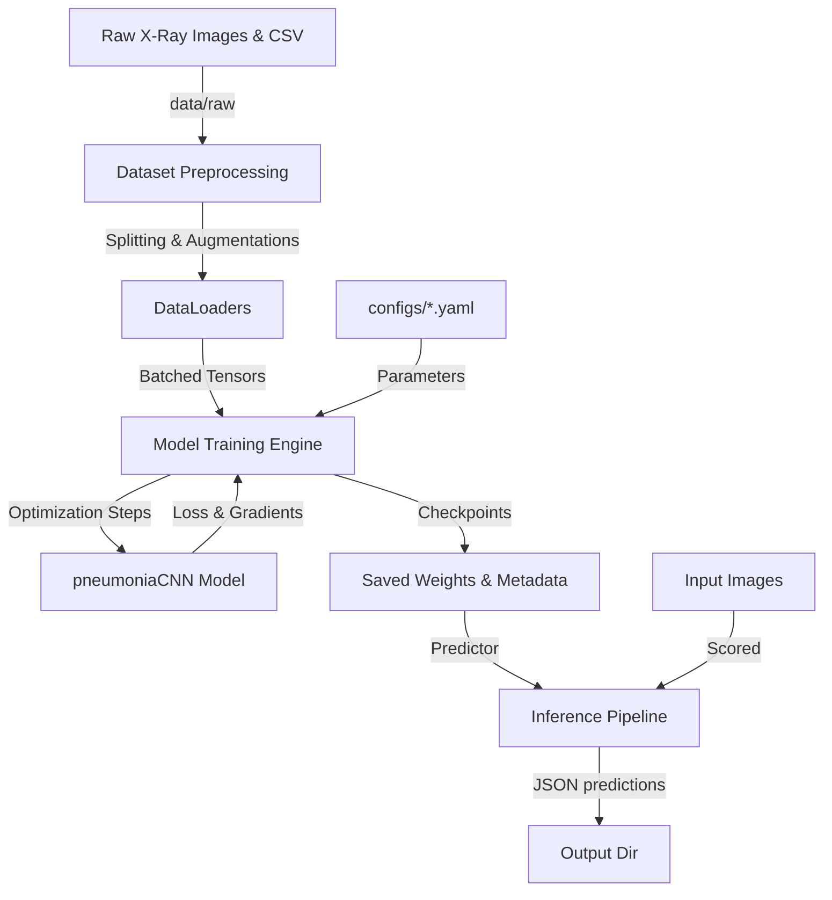

# Architecture Documentation

This document describes the high-level architecture, design decisions, and data flow of the Pneumonia Detection MLOps repository.

---

## 🏛️ System Architecture Diagram

## ⚙️ Components Layout

1. **`configs/`**: Container for all model, training, testing, and data parameter overrides.
2. **`src/pneumonia_detection/data/`**: Implements raw image loading, leakage-free augmentations (transforms), and stratified dataset splitting.
3. **`src/pneumonia_detection/models/`**: Houses the custom deep convolutional network, including skip identity projections and channel Squeeze-and-Excitation (`SEBlock`) layers.
4. **`src/pneumonia_detection/training/`**: The core trainer class executing training epochs, validation metrics scoring, and checkpoint serialization.
5. **`src/pneumonia_detection/inference/`**: A class interface providing utilities to score single images or directories of PNG files.
6. **`src/pneumonia_detection/pipelines/`**: Executable entry points for end-to-end training and batch/single inference.
7. **`tests/`**: Test suite evaluating conversions, dataloaders, model structures, and optimizer operations using on-the-fly synthetic data generation.
